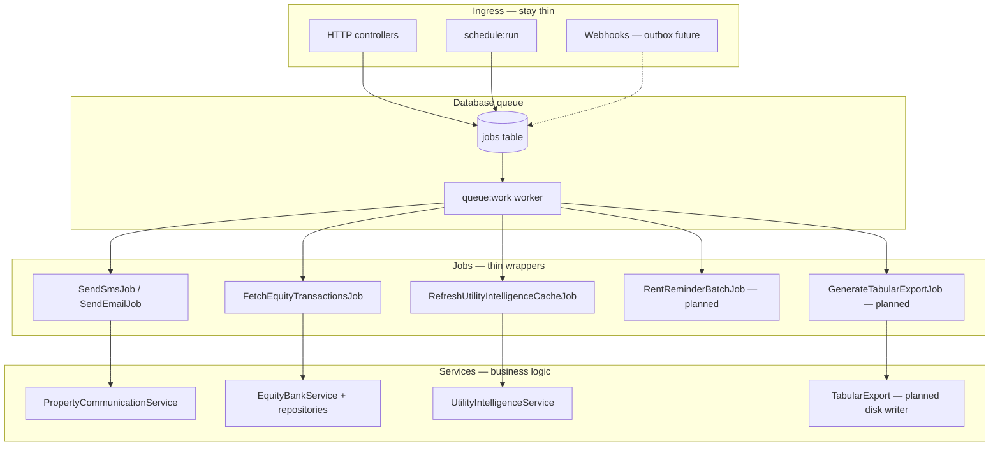

# Background Jobs Roadmap

**Phase 4 — architecture plan and first safe conversions**

This document maps slow synchronous work to the queue layer incrementally. Business logic stays in **services**; jobs are thin wrappers that call services or existing Artisan commands.

**Principles**

- HTTP/webhook controllers should enqueue work and return quickly (long-term goal).
- Do not duplicate billing, matching, or communication logic inside jobs.
- Convert one area at a time; verify queue worker + scheduler in production first ([QUEUE-WORKER-SETUP.md](QUEUE-WORKER-SETUP.md), [SCHEDULER-SETUP.md](SCHEDULER-SETUP.md)).

---

## Current job inventory

| Job | Trigger | Queue | Status |
|-----|---------|-------|--------|
| `SendEmailJob` | `PropertyCommunicationService` | async | ✅ Production-ready |
| `SendSmsJob` | `PropertyCommunicationService` | async | ✅ Production-ready |
| `SendBulkCommunicationJob` | `PropertyCommunicationService` | async | ✅ Production-ready |
| `SendPayrollPayslipEmailJob` | `PropertyAccountingController` | async | ✅ Production-ready |
| `RefreshUtilityIntelligenceCacheJob` | `PropertyUtilityChargeController` | async | ✅ Production-ready |
| `FetchEquityTransactionsJob` | Scheduler + Equity UI button | async *(Phase 4)* | ✅ Converted from `dispatchSync` |
| `SendRentReminderJob` | *(unused)* | async | ⚠️ Stub only — see rent plan below |

All jobs use the `default` queue unless noted. Worker command:

```bash
php artisan queue:work database --sleep=3 --tries=3 --max-time=3600
```

---

## Phase 4 inspection summary

### 1. SMS / email — verify only ✅

**Finding:** Already queued correctly.

Flow:

1. Controller or command calls `PropertyCommunicationService::sendNow()` / `schedule()`.
2. Service persists `PmMessage` + recipients in a DB transaction.
3. Service dispatches `SendBulkCommunicationJob`, which fans out to `SendSmsJob` / `SendEmailJob`.
4. Failed sends retry via delayed job dispatch (`retry_count` / `max_retries`).

Idempotency: `idempotency_key` on `PmMessage` prevents duplicate message rows.

**Action:** None required. Monitor `failed_jobs` and provider credentials.

---

### 2. Equity sync — converted ✅ *(Phase 4 implementation)*

**Before:** `fetch:equity-transactions` used `FetchEquityTransactionsJob::dispatchSync()`, blocking the scheduler cron tick and HTTP trigger for up to 240 seconds.

**After:**

- Default: `FetchEquityTransactionsJob::dispatch()` (async).
- Debug escape hatch: `php artisan fetch:equity-transactions --sync`.
- UI button dispatches the job directly (no inline HTTP wait).
- Job implements `ShouldBeUnique` (`equity-sync`, 10 min) + cache lock `equity-sync-lock` to prevent pile-up.

**Requires:** Queue worker running in production.

**Rollback:** Run with `--sync` or temporarily change command back to `dispatchSync` (not recommended in production).

---

### 3. Utility intelligence cache — verify only ✅

**Finding:** Already queued.

`PropertyUtilityChargeController::refreshUtilityIntelligence()` calls `forgetCache()` then `RefreshUtilityIntelligenceCacheJob::dispatch($agentUserId)`.

HTTP returns immediately; dashboard cache rebuilds in the worker.

**Action:** None required.

---

### 4. Rent reminders — chunked plan 📋 *(not implemented)*

**Current behaviour:**

- Scheduler runs `rent:send-reminders` synchronously (up to 120 min overlap lock).
- Command loads up to **500** open rent invoices and loops in-process.
- For each invoice it calls `PropertyCommunicationService::sendNow()`, which **already queues** per-message SMS/email jobs.
- Bottleneck: scheduler process time + DB load for the loop, not the actual sends.

**Unused asset:** `SendRentReminderJob` wraps `Artisan::call('rent:send-reminders')` — does not help chunking.

**Proposed Phase 5 design** (approval required before coding):

```
rent:send-reminders (scheduler)
  └─► RentReminderBatchJob (query invoice IDs for month, chunk by 50)
        └─► ProcessRentReminderInvoiceJob (per invoice — calls service only)
              └─► SendSmsJob / SendEmailJob (existing)
```

| Step | Class | Responsibility |
|------|-------|----------------|
| 1 | `RentReminderBatchJob` | Query eligible invoice IDs; dispatch chunk jobs; no sends |
| 2 | `ProcessRentReminderInvoiceJob` | One invoice → `PropertyCommunicationService` (existing idempotency keys) |
| 3 | Scheduler | Dispatch batch job only; exit in seconds |

**Idempotency preserved:** Existing keys `rent:email:{id}:{stage}:{Y-m}` and `rent:sms:...`.

**Risk if rushed:** Double sends if batch + sync command run together without gates.

---

### 5. Large exports — queued export plan 📋 *(not implemented)*

**Current behaviour:** ~30+ controller actions call `TabularExport::stream()` or `CsvExport::stream()` inline during the HTTP request. Row limits vary (500–10,000). Large PDF generation can exceed PHP timeout/memory.

**Heavy examples:**

| Area | Controller | Typical limit |
|------|------------|---------------|
| Equity payments | `EquitySyncController` | 10,000 rows |
| Super Admin audit | `SuperAdminConsoleController` | unbounded selection |
| Property accounting | `PropertyAccountingController` | multi-tab exports |
| Loan books | `LoanBookOperationsController`, `LoanAccountingController` | large CSV/PDF |

**Proposed Phase 6 design:**

```
HTTP POST export request
  └─► GenerateTabularExportJob
        └─► TabularExport::writeToDisk()  (new helper — same row closure)
              └─► Notify user (flash / email / export_ready table)
```

| Component | Purpose |
|-----------|---------|
| `export_requests` table | status, path, user_id, expires_at |
| `GenerateTabularExportJob` | Runs query + writes file to `storage/app/exports` |
| Download route | Signed URL when `status=ready` |

**Start with:** Super Admin audit export and Equity payment export (highest row counts).

**Risk if rushed:** Users expect instant download; UX must change to “preparing export…”.

---

### 6. Webhooks — inspect only 🛑 *(no conversion without approval)*

**Controllers:**

| Controller | Endpoint role | Sync today | Async risk |
|------------|---------------|------------|------------|
| `PropertyPaymentWebhookController` | SMS ingest, STK callback, bank callback | Inline match + post payment | **High** — provider expects fast HTTP 200; duplicate delivery if job retries wrong |
| `LoanPaymentWebhookController` | Loan SMS ingest | Inline | **High** — same |
| `MpesaDarajaWebhookController` | Daraja STK/B2C callbacks | Inline | **High** — Safaricom retries on slow/5xx |
| `PropertyCommunicationWebhookController` | Delivery receipts | Inline | Medium |

**Why not convert yet:**

- Payment webhooks must ack quickly and be idempotent on the **HTTP layer** (many providers retry within seconds).
- Moving to queue requires: persist raw payload first → return 200 → process in job (outbox pattern).
- Incorrect retry semantics could double-post payments.

**Recommended future pattern:**

1. Insert `webhook_inbox` row (unique provider event id).
2. Return 200 immediately.
3. `ProcessWebhookInboxJob` calls existing settlement/matching services.
4. Never convert until inbox schema + idempotency tests exist.

---

## Safe conversions

| Item | Risk | Phase 4 action |
|------|------|----------------|
| SMS/email via `PropertyCommunicationService` | Low | Verified — no change |
| Utility cache refresh job | Low | Verified — no change |
| Equity sync → async dispatch | Low | **Implemented** |
| Payroll payslip email job | Low | Already async |
| `queue:prune-failed` on scheduler | Low | Done in Phase 2 |

---

## Risky conversions — do not batch

| Item | Risk | Why |
|------|------|-----|
| Payment/SMS webhooks | **Critical** | Provider retry + double settlement |
| `rent:generate-invoices` in scheduler | **High** | GL posting; already idempotent but must stay observable in scheduler log |
| `water:generate-invoices` / penalties | **High** | Billing side-effects |
| `loan:accrue-penalties` | **High** | GL accrual |
| Bulk export inline → queue | **Medium** | UX change + auth on download links |
| Rent reminder full async chunking | **Medium** | Monthly comms volume; needs batch job design |
| `bulksms:dispatch-schedules` | **Medium** | Wallet debit; status machine already protects |

---

## Implementation recommendation

### Done in Phase 4

1. ✅ Equity sync async (`dispatch` + `ShouldBeUnique` + structured log line).
2. ✅ Document roadmap (this file).
3. ✅ Verify SMS/email and utility cache paths.

### Next (Phase 5 — after production worker stable 1–2 weeks)

1. **Rent reminder chunking** — implement `RentReminderBatchJob` + per-invoice jobs; scheduler dispatches one batch job on the 1st.
2. **Webhook outbox** — design `webhook_inbox` table; do not switch live endpoints until tests cover duplicate delivery.

### Later (Phase 6)

1. **Queued exports** — pilot on Super Admin audit + Equity all-payments export.
2. **Thin controllers** — HTTP actions return `{ queued: true, export_id }` or `{ sync_run_id }` patterns.

### Operator checklist after Phase 4

```bash
# Worker must be running before Equity async is useful
php artisan queue:work database --sleep=3 --tries=3 --max-time=3600

# Manual sync (blocking — debugging only)
php artisan fetch:equity-transactions --manual --sync

# Normal manual queue
php artisan fetch:equity-transactions --manual

# Watch results
php artisan queue:failed
tail -f storage/logs/laravel.log | grep "Equity sync"
# equity_sync_runs table / Property → Equity → Sync status UI
```

---

## Architecture diagram (target state)



---

## Related docs

- [QUEUE-WORKER-SETUP.md](QUEUE-WORKER-SETUP.md)
- [SCHEDULER-SETUP.md](SCHEDULER-SETUP.md)
- [PRODUCTION-READINESS-PHASE-1.md](PRODUCTION-READINESS-PHASE-1.md)

---

*Phase 4: one low-risk conversion (Equity async). Billing logic unchanged. Webhooks and bulk exports remain synchronous pending approval.*
