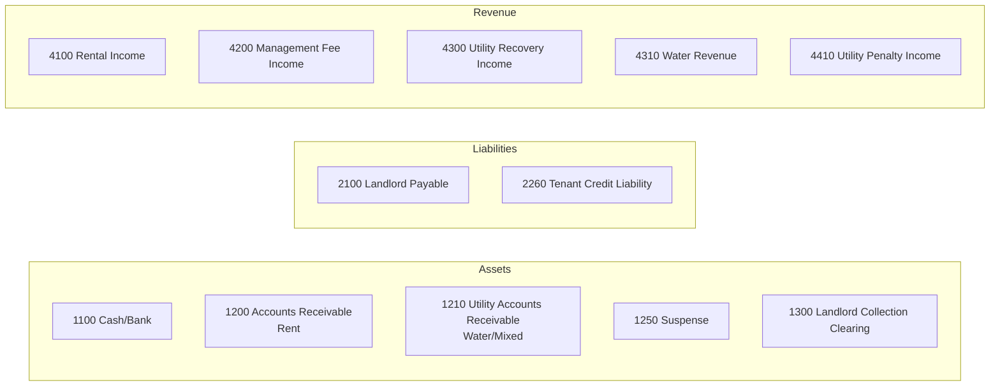
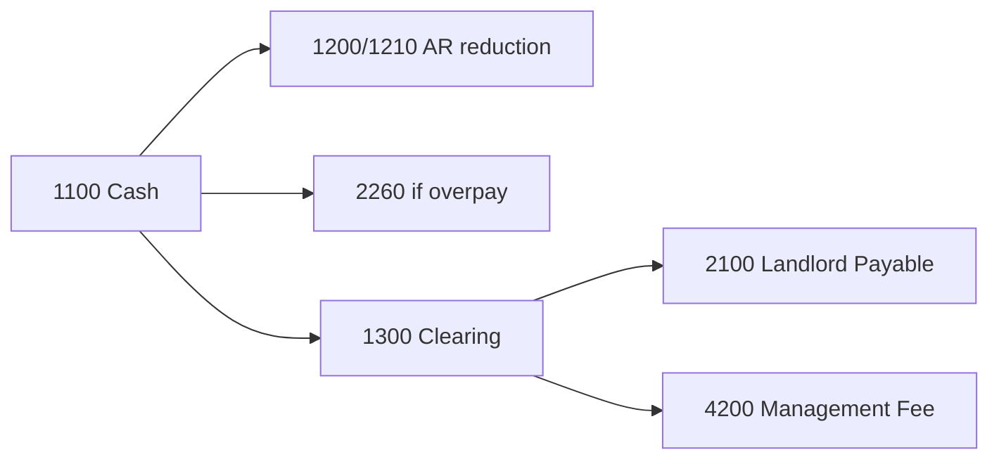
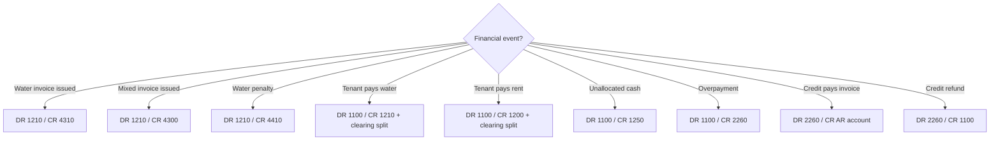

# Utility Accounting Policy

**Version:** 1.0 (Governance baseline)  
**Owner:** Finance / Trust accounting (pending sign-off)  
**Chart basis:** Trust GL migration `2026_05_05_095500` + utility accounts `2026_05_25_100000`

---

## 1. Policy Principles

1. **Trust accounting** — Tenant receipts pass through agent trust; landlord payable and management fee are derived from collections.
2. **Separate AR by revenue type** — Rent (1200) and utility/water (1210) are distinct receivable accounts.
3. **Incremental penalty posting** — Penalties post as separate events; they do not re-post the original invoice batch.
4. **Idempotent journals** — Each financial event maps to at most one active posted batch per `(source_type, source_id, event_type)`.
5. **Suspense for unidentified cash** — Unallocated receipts go to 1250 until identified or credited.

---

## 2. Chart of Accounts Map (Utility Billing)

| Code | Name | Category | Utility billing role |
|------|------|----------|---------------------|
| 1100 | Cash / Bank | Asset | Receipt of tenant payments and credit refunds |
| 1200 | Accounts Receivable | Asset | Rent invoice AR |
| **1210** | **Utility Accounts Receivable** | **Asset** | **Water and mixed utility invoice AR; penalty AR** |
| **1250** | **Suspense** | **Asset** | **Unmatched / unidentified tenant receipts** |
| 1300 | Landlord Collection Clearing | Asset | Interim clearing on payment settlement |
| 2100 | Landlord Payable | Liability | Net owed to landlord after commission |
| **2260** | **Tenant Credit Liability** | **Liability** | **Tenant advance / overpayment balance** |
| 4100 | Rental Income | Revenue | Rent invoice recognition |
| 4200 | Management Fee Income | Revenue | Agent commission on collections |
| 4300 | Utility Recovery Income | Revenue | Mixed invoice utility portion (fallback) |
| **4310** | **Water Revenue** | **Revenue** | **Water invoice recognition** |
| **4410** | **Utility Penalty Income** | **Revenue** | **Water late penalty recognition** |

---

## 3. What Hits Each Account

### 3.1 Revenue Accounts

| Account | Debited by | Credited by | Business meaning |
|---------|------------|-------------|------------------|
| **4310 Water Revenue** | — | Water invoice issued (`invoice_type = water`) | Meter water recovery billed to tenant |
| **4300 Utility Recovery Income** | — | Mixed invoice issued (`invoice_type = mixed`) | Non-water utility or bundled recovery |
| **4410 Utility Penalty Income** | — | Water penalty applied | Late payment penalty on water AR |
| 4100 Rental Income | — | Rent invoice issued | Out of water scope but shares payment flow |
| 4200 Management Fee Income | — | Payment received (commission portion) | Agent fee on **all** scoped collections today |

**Policy question (open):** Should water collections attract the same management commission as rent? Currently **yes** (implemented); finance must confirm.

### 3.2 Liability Accounts

| Account | Debited by | Credited by | Business meaning |
|---------|------------|-------------|------------------|
| **2260 Tenant Credit Liability** | Credit applied to invoice; credit refunded | Overpayment creates credit; manual credit deposit | Tenant prepayment obligation to tenant |
| **2100 Landlord Payable** | Payment settlement (net to landlord) | — | Amount owed to property owner |

### 3.3 Suspense

| Account | Debited by | Credited by | Business meaning |
|---------|------------|-------------|------------------|
| **1250 Suspense** | — | Unmatched payment (`payment_unmatched_suspense`) | Cash received but not tied to invoice or credit |

**Release from suspense (target policy):**
1. Identify tenant → reclassify to allocation (DR 1250 / CR 1210 or 1200) ⚠ manual process today
2. Refund → DR 1250 / CR 1100

### 3.4 Receivable Accounts

| Account | Debited by | Credited by | Business meaning |
|---------|------------|-------------|------------------|
| **1210 Utility AR** | Water/mixed invoice issued; water penalty applied | Payment allocation (water); tenant credit apply ⚠ | Tenant owes for water/utility |
| 1200 Rent AR | Rent invoice issued | Payment allocation (rent); tenant credit apply | Tenant owes for rent |

### 3.5 Landlord Payable vs Clearing

On **settlement path** (`PropertyPaymentSettlementService::finalizeIdentifiedPayment`):

**Gap:** Manual payment paths (`PmPaymentController::store`, `PmInvoiceController::recordPayment`) post `payment_received` but may **skip** landlord ledger — see RISK-MATRIX R3.

---

## 4. Event → Journal Catalog (Utility)

### 4.1 Invoice Issued

| Condition | DR | CR | event_type |
|-----------|----|----|------------|
| `invoice_type = water` | 1210 | 4310 | `invoice_issued` |
| `invoice_type = mixed` | 1210 | 4300 | `invoice_issued` |
| `invoice_type = rent` | 1200 | 4100 | `invoice_issued` |

**Not posted when:** amount ≤ 0, status = cancelled, kind = credit_note.

**Legacy path gap:** Manual `PmUnitUtilityCharge` invoices **do not post** — RISK-MATRIX R1.

### 4.2 Water Penalty Applied

| DR | CR | event_type |
|----|----|------------|
| 1210 | 4410 | `water_penalty_applied` |

Penalty amount increases invoice header `amount`; GL is incremental (original invoice batch unchanged).

### 4.3 Payment Received

Composite entry (simplified):

| Component | DR | CR |
|-----------|----|----|
| Gross receipt | 1100 | — |
| Allocation to rent invoice | — | 1200 |
| Allocation to water invoice | — | 1210 |
| Overpayment to credit | — | 2260 |
| Landlord clearing | — | 1300 |
| Landlord payable (net) | 1300 | 2100 |
| Commission | 1300 | 4200 |

Allocation split follows `pm_payment_allocations` by invoice type.

### 4.4 Unmatched Payment (Suspense)

| DR | CR | event_type |
|----|----|------------|
| 1100 | 1250 | `payment_unmatched_suspense` |

Triggered when overpayment cannot create tenant credit (no credit tables) or explicit unmatched flow.

### 4.5 Tenant Credit Applied

| DR | CR | event_type | **Policy gap** |
|----|----|------------|----------------|
| 2260 | **1200** | `tenant_credit_applied` | **Always credits 1200 today** |

**Target policy:** Credit apply should credit **1210** when paying water invoices — RISK-MATRIX R2.

### 4.6 Tenant Credit Refunded

| DR | CR | event_type |
|----|----|------------|
| 2260 | 1100 | `tenant_credit_refunded` |

### 4.7 Reversals

| Original event | Reversal event | Effect |
|----------------|----------------|--------|
| `invoice_issued` | `invoice_issued_reversal` | Swap DR/CR |
| `invoice_issued` (edit) | `invoice_issued_reversal` + `invoice_issued_rev_N` | Reverse then repost new amount |
| `water_penalty_applied` | `water_penalty_reversal` | Swap DR/CR |
| `payment_received` | payment reversal batch | Swap DR/CR; allocations marked reversed |

---

## 5. Accounting Decision Tree

---

## 6. Recognition Timing

| Event | Recognition point | Period attribution |
|-------|-------------------|-------------------|
| Water invoice | `issue_date` on batch | `billing_period` on invoice |
| Penalty | Date penalty applied (`applied_at`) | Same period as application run |
| Payment | `paid_at` on payment | Cash basis for clearing/payable |
| Credit created | Payment settlement date | Liability until applied |
| Credit applied | Application timestamp | Reduces AR in application period |

**Accrual vs cash:** Invoice and penalty are **accrual** (AR + revenue). Landlord payable movement is **cash-based** on collection (settlement path).

---

## 7. Accounts Explicitly NOT Used (Utility Billing)

| Code | Name | Note |
|------|------|------|
| 2300 | Accounts Payable | Provider bills — separate module |
| 4400 | Penalty Income (generic) | Fallback only; water uses 4410 |
| 5101 | Maintenance Expense | Not utility tenant billing |

---

## 8. Policy Exceptions Register

| ID | Exception | Current behavior | Target policy |
|----|-----------|------------------|---------------|
| AP1 | Legacy manual charge invoices | No GL | Post same as water invoice or retire path |
| AP2 | Tenant credit apply | Always CR 1200 | CR 1210 when allocation is water |
| AP3 | Manual invoice payment | May skip landlord ledger | Must use settlement finalization |
| AP4 | Water penalty on cancelled invoice | Blocked by open balance check | Explicit guard in service |
| AP5 | Commission on water | Same as rent | Finance decision pending |

---

## 9. Sign-Off

| Role | Name | Date | Signature |
|------|------|------|-----------|
| Engineering | | | |
| Finance / Trust | | | |
| Product | | | |
