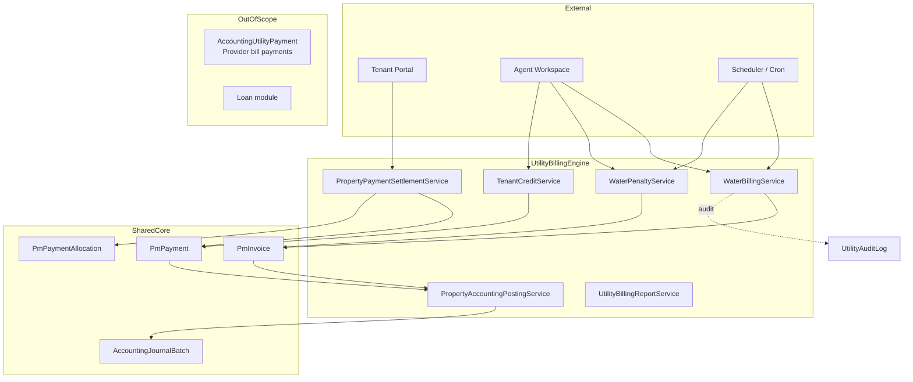
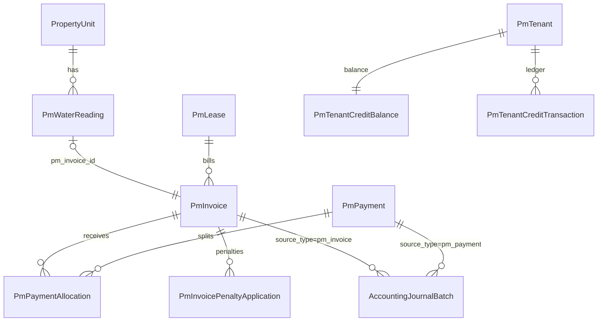
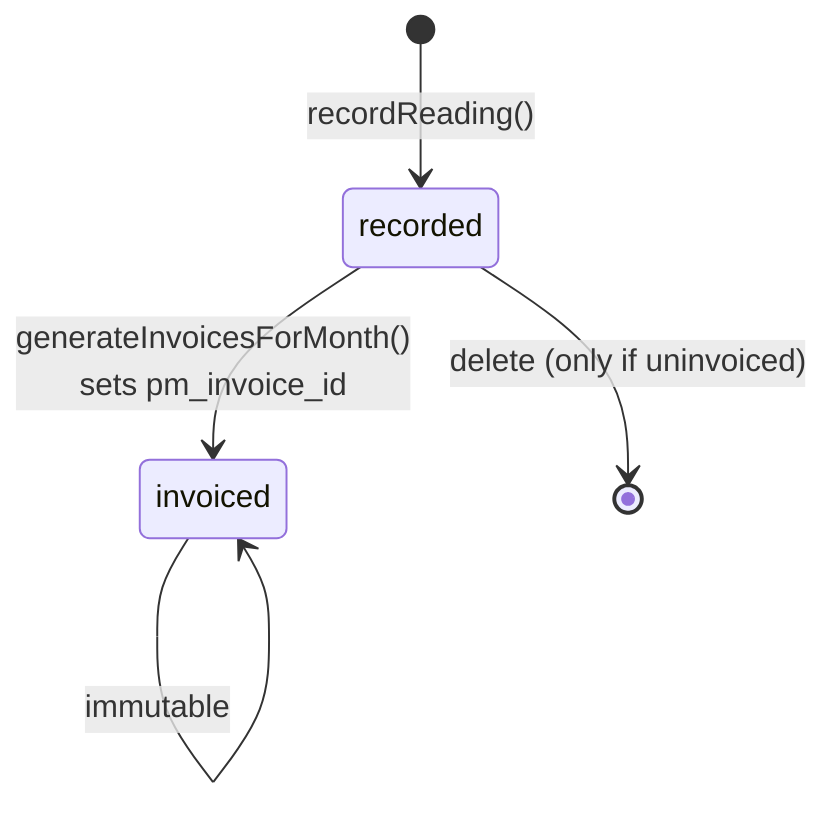
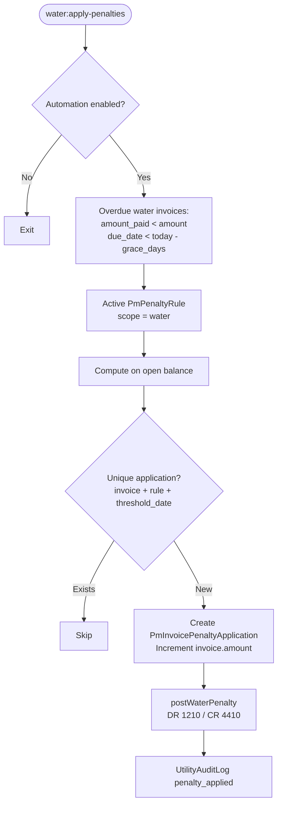
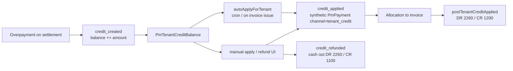
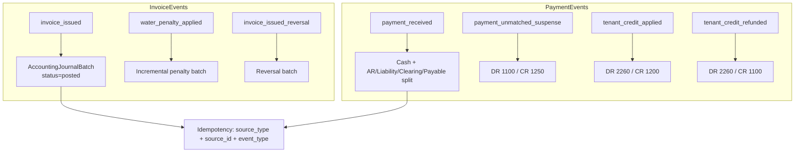
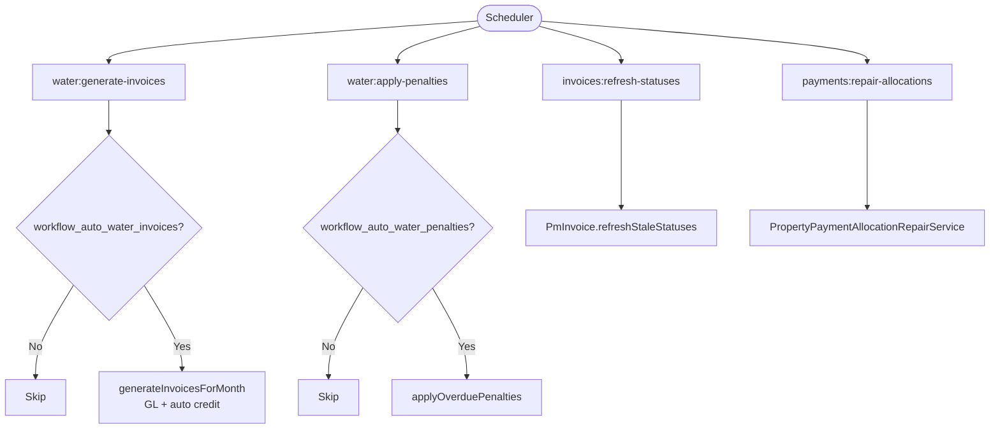

# Water Billing Architecture

**Version:** 1.0 (Governance baseline)  
**Status:** Documentation only — reflects current system + target boundaries

---

## 1. System Overview

The utility billing engine is a **multi-domain financial subsystem** embedded in the property management portal. It shares infrastructure with rent billing but maintains distinct invoice types, receivable accounts, and automation workflows.

### 1.1 Domains

| Domain | Responsibility | Primary owner service |
|--------|----------------|----------------------|
| Meter readings | Capture consumption, calculate charge | `WaterBillingService` |
| Utility invoicing | Create AR documents (`invoice_type = water`) | `WaterBillingService`, `PmInvoiceController` |
| Penalties | Late fees on overdue water AR | `WaterPenaltyService` |
| Tenant credit | Advance balances from overpayments | `TenantCreditService` |
| Payment allocation | Apply receipts to open invoices | `PropertyPaymentSettlementService` |
| GL integration | Trust journal batches | `PropertyAccountingPostingService` |
| Automation | Scheduled invoice/penalty runs | Console commands + portal toggles |
| Reporting | Billing summary, aging, consumption | `UtilityBillingReportService` |

### 1.2 System Boundaries



**In scope:** Tenant-facing water AR, meter readings, penalties, credit, trust GL.  
**Out of scope (separate subsystem):** `AccountingUtilityPayment` (agent pays utility providers), loan module, maintenance job costing.

### 1.3 Dual Billing Paths (Critical Boundary)

Two paths create water-related invoices today:

| Path | Entry | GL on issue | Auto credit | Audit log | Status |
|------|-------|-------------|-------------|-----------|--------|
| **A — Meter (canonical)** | `WaterBillingService::generateInvoicesForMonth()` | Yes | Yes | Yes | **System of record** |
| **B — Manual charge (legacy)** | `WaterBillingService::generateUtilityInvoices()` via `PmUnitUtilityCharge` | No | No | No | **Deprecated pending alignment** |

Governance rule: new features must only extend Path A unless Path B is explicitly brought to parity.

---

## 2. Entity Relationship (Conceptual)



---

## 3. Reading Lifecycle



**Calculation:** `amount = (units_used × rate_per_unit) + fixed_charge`  
**Units:** `current - previous` unless `is_meter_reset` (then `units_used = current`)

**Preconditions for invoicing:**
- Active lease on unit
- Reading status = `recorded`
- No existing water invoice for unit + tenant + `billing_period`
- Calculated amount > 0

**Post-invoicing:**
- Reading status → `invoiced`
- `UtilityAuditLog` action `invoice_generated`
- Optional `TenantCreditService::autoApplyForTenant()`

---

## 4. Invoice Flow

```mermaid
flowchart TD
    START([Billing period ready]) --> READ{Readings recorded?}
    READ -->|No| BLOCK[Block generation / report uninvoiced]
    READ -->|Yes| GEN[WaterBillingService.generateInvoicesForMonth]

    GEN --> LEASE{Active lease?}
    LEASE -->|No| SKIP1[Skip unit]
    LEASE -->|Yes| DUP{Duplicate water invoice?}
    DUP -->|Yes| SKIP2[Skip unit]
    DUP -->|No| AMT{Amount > 0?}
    AMT -->|No| SKIP3[Skip unit]
    AMT -->|Yes| CREATE[Create PmInvoice<br/>type=water, status=sent]

    CREATE --> GL[PropertyAccountingPostingService<br/>postInvoiceIssued]
    GL --> LINK[Link reading.pm_invoice_id<br/>status=invoiced]
    LINK --> CREDIT{Auto credit enabled?}
    CREDIT -->|Yes| AC[TenantCreditService.autoApplyForTenant]
    CREDIT -->|No| OPEN[Invoice open]
    AC --> OPEN

    OPEN --> PAY[Payments / credit settle AR]
    PAY --> REFRESH[PmInvoice.refreshComputedStatus]
    REFRESH --> DONE([paid | partial | overdue | sent])
```

**Invoice identity:**
- `invoice_type = water`
- `billing_period` = YYYY-MM (meter path)
- `invoice_kind = invoice` (credit notes are separate)

**GL at issue:** DR 1210 Utility AR / CR 4310 Water Revenue (see ACCOUNTING-POLICY.md)

---

## 5. Payment Allocation Flow

```mermaid
flowchart TD
    PAYIN([Payment received]) --> CHAN{Channel?}
    CHAN -->|stk / advance / settle| SETTLE[PropertyPaymentSettlementService]
    CHAN -->|manual to invoice| DIRECT[PmPaymentController / PmInvoiceController]
    CHAN -->|tenant_credit| SYNTH[TenantCreditService synthetic payment]

    SETTLE --> SCOPE[Read meta.bill_scope<br/>all | rent | water]
    SCOPE --> QUERY[Open invoices:<br/>amount_paid < amount<br/>not cancelled]
    QUERY --> FILTER{Scope filter}
    FILTER -->|rent| RENT[invoice_type = rent]
    FILTER -->|water| WATER[invoice_type = water]
    FILTER -->|all| ALL[no type filter]

    RENT --> SORT[Order: due_date ASC, id ASC]
    WATER --> SORT
    ALL --> SORT

    SORT --> ALLOC[Create PmPaymentAllocation rows<br/>sync amount_paid each step]
    ALLOC --> REM{Remaining > 0?}
    REM -->|Yes| CREDIT{Credit tables exist?}
    CREDIT -->|Yes| OVER[TenantCreditService.createCreditFromOverpayment]
    CREDIT -->|No| SUSP[postUnmatchedPaymentToSuspense]
    REM -->|No| GLPOST[postPaymentReceived + landlord ledger]

    OVER --> GLPOST
    SUSP --> GLPOST
    DIRECT --> GLPOST
    SYNTH --> GLPOST
```

**Source of truth for `amount_paid`:** Sum of non-reversed `pm_payment_allocations` via `PmInvoice::syncAmountPaidFromAllocations()`.

---

## 6. Penalty Flow



**Reversal path:** `WaterPenaltyService::reverseApplication()` → reduce invoice amount → `reverseWaterPenalty()` GL → set `reversed_at` on application.

Penalties **increment header amount**; they do not create `pm_invoice_items` lines. Original `invoice_issued` journal batch is unchanged; penalty posts as separate `water_penalty_applied` event.

---

## 7. Reversal Flow

```mermaid
flowchart TD
    subgraph PaymentReversal
        PR1[Agent requests reversal] --> PR2[PropertyPaymentReversalApprovalService]
        PR2 --> PR3[PropertyTransactionReversalService]
        PR3 --> PR4[Reverse payment_received journal]
        PR4 --> PR5[Mark allocations is_reversed]
        PR5 --> PR6[Reduce invoice amount_paid]
        PR6 --> PR7[Reverse landlord ledger credits]
        PR7 --> PR8[Payment status = failed]
    end

    subgraph PenaltyReversal
        PEN1[reverseWaterPenalty UI] --> PEN2[WaterPenaltyService.reverseApplication]
        PEN2 --> PEN3[Reduce invoice.amount]
        PEN3 --> PEN4[reverseWaterPenalty GL]
        PEN4 --> PEN5[Application.reversed_at set]
    end

    subgraph InvoiceReversal
        INV1[Cancel / delete / edit amount] --> INV2[reverseInvoiceIssued or repostInvoiceAfterEdit]
    end
```



See GOVERNANCE-RULES.md § Reversal Propagation for cross-entity rules and known gaps.

---

## 8. Tenant Credit Lifecycle



**Governance note:** Credit apply GL currently credits **1200 Rent AR** regardless of invoice type — documented as gap R2 in RISK-MATRIX.md.

**Unused type:** `credit_reversed` is defined but not wired in services.

---

## 9. GL Posting Lifecycle



**Idempotency keys:** `source_type`, `source_id`, `event_type`, `source_key` (e.g. `pm_invoice:{id}:issued`).

**Revision model:** Invoice edits call `reverseInvoiceIssued()` then post new batch with `invoice_issued_rev_N` event type.

---

## 10. Automation Lifecycle



**Portal settings** (`PropertyPortalSetting`):
- `workflow_auto_water_invoices`
- `workflow_auto_water_penalties`
- Overridable via `PROPERTY_WORKFLOW_AUTOMATION_ENABLED` env

**Default water invoice due date:** 5th of month following billing period (cron command default).

---

## 11. Reporting Layer

`UtilityBillingReportService` provides read-only aggregates:

- Billing summary by period
- Water AR aging
- Consumption trends
- Manual charge listing

Reports **must not mutate state**. They read from `PmInvoice`, `PmWaterReading`, `PmUnitUtilityCharge`, and allocation sums.

---

## 12. Audit Trail

| Event | Log location |
|-------|--------------|
| Reading recorded | `UtilityAuditLog.action = reading_recorded` |
| Invoice generated | `UtilityAuditLog.action = invoice_generated` |
| Penalty applied | `UtilityAuditLog.action = penalty_applied` |
| Penalty reversed | `UtilityAuditLog.action = penalty_reversed` |
| Invoice status change | `PmInvoiceEvent` |
| GL posting | `AccountingJournalBatch` + lines |

---

## 13. Non-Goals (Governance Mode)

- Provider utility bill payment (`AccountingUtilityPayment`)
- Line-item invoice model for water (future design)
- Landlord-specific utility pass-through accounting (currently uses rent collection pattern)
- Multi-currency utility billing
