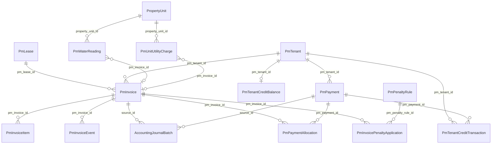
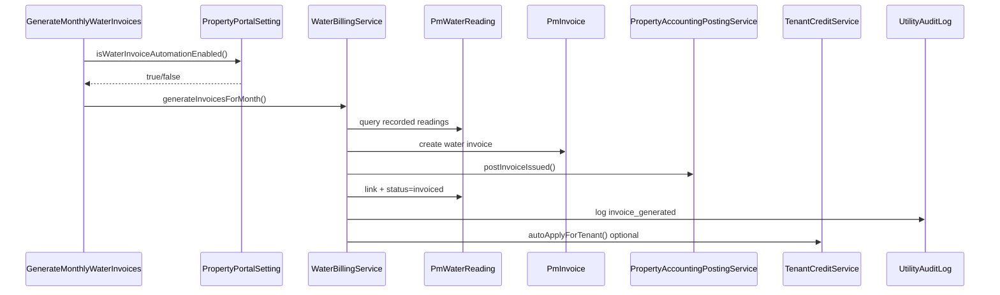
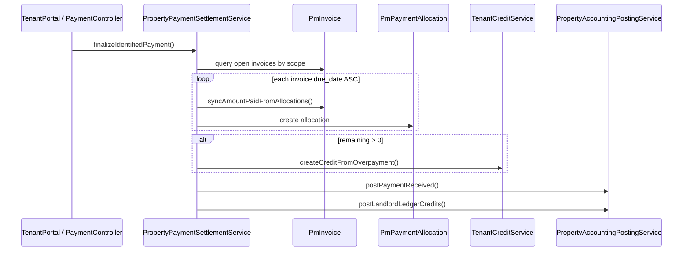
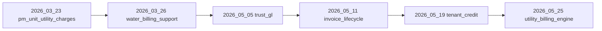

# Utility Billing Dependencies

**Version:** 1.0 (Governance baseline)  
**Purpose:** Service, model, and automation dependency maps for change-impact analysis.

---

## 1. High-Level Dependency Graph

```mermaid
flowchart TB
    subgraph Presentation
        PUC[PropertyUtilityChargeController]
        PIC[PmInvoiceController]
        PPC[PmPaymentController]
        PTC[PmTenantCreditController]
        TPC[TenantPortalController]
        PRC[PropertyReportsController]
    end

    subgraph DomainServices
        WBS[WaterBillingService]
        WPS[WaterPenaltyService]
        TCS[TenantCreditService]
        PSS[PropertyPaymentSettlementService]
        PAR[PropertyPaymentAllocationRepairService]
        APS[PropertyAccountingPostingService]
        TRS[PropertyTransactionReversalService]
        PRAS[PropertyPaymentReversalApprovalService]
        UBR[UtilityBillingReportService]
        RIG[RentInvoiceGenerator]
    end

    subgraph Models
        WR[PmWaterReading]
        INV[PmInvoice]
        PAY[PmPayment]
        ALLOC[PmPaymentAllocation]
        IPA[PmInvoicePenaltyApplication]
        TCB[PmTenantCreditBalance]
        TCT[PmTenantCreditTransaction]
        UAL[UtilityAuditLog]
        UUC[PmUnitUtilityCharge]
        PRU[PmPenaltyRule]
    end

    subgraph Infrastructure
        GL[AccountingJournalBatch]
        PJS[PropertyJournalService]
        PPS[PropertyPortalSetting]
    end

    subgraph Automation
        GWI[GenerateMonthlyWaterInvoices]
        AWP[ApplyOverdueWaterPenalties]
        RIS[RefreshInvoiceStatuses]
        RPA[RepairPaymentAllocations]
    end

    PUC --> WBS
    PUC --> WPS
    PIC --> APS
    PIC --> INV
    PPC --> PSS
    PPC --> APS
    PPC --> PRAS
    PTC --> TCS
    TPC --> PSS
    PRC --> UBR

    WBS --> WR
    WBS --> INV
    WBS --> TCS
    WBS --> APS
    WBS --> UAL
    WPS --> IPA
    WPS --> INV
    WPS --> APS
    WPS --> UAL
    TCS --> TCB
    TCS --> TCT
    TCS --> PAY
    TCS --> APS
    PSS --> PAY
    PSS --> ALLOC
    PSS --> INV
    PSS --> TCS
    PSS --> APS
    PAR --> PSS
    PAR --> ALLOC
    TRS --> APS
    PRAS --> TRS

    APS --> PJS
    APS --> GL

    GWI --> WBS
    GWI --> PPS
    AWP --> WPS
    AWP --> PPS
    RIS --> INV
    RPA --> PAR
```



---

## 2. Service Dependency Matrix

| Service | Depends on | Depended on by |
|---------|------------|----------------|
| `WaterBillingService` | `TenantCreditService`, `PropertyAccountingPostingService`, `PmWaterReading`, `PmInvoice`, `PmLease`, `UtilityAuditLog` | `PropertyUtilityChargeController`, `GenerateMonthlyWaterInvoices` |
| `WaterPenaltyService` | `PropertyAccountingPostingService`, `PmInvoice`, `PmPenaltyRule`, `PmInvoicePenaltyApplication`, `UtilityAuditLog` | `PropertyUtilityChargeController`, `ApplyOverdueWaterPenalties` |
| `TenantCreditService` | `PropertyAccountingPostingService`, `PmTenantCreditBalance`, `PmTenantCreditTransaction`, `PmPayment`, `PmInvoice` | `WaterBillingService`, `PropertyPaymentSettlementService`, `PmTenantCreditController`, `GenerateMonthlyWaterInvoices` |
| `PropertyPaymentSettlementService` | `TenantCreditService`, `PropertyAccountingPostingService`, `PmPayment`, `PmInvoice`, `PmPaymentAllocation` | `PmPaymentController`, `TenantPortalController`, `PropertyPaymentAllocationRepairService` |
| `PropertyPaymentAllocationRepairService` | `PropertyPaymentSettlementService`, `PmPayment`, `PmInvoice` | `RepairPaymentAllocations` |
| `PropertyAccountingPostingService` | `PropertyJournalService`, `AccountingJournalBatch`, `AccountingChartAccount` | All posting paths |
| `PropertyTransactionReversalService` | `PropertyAccountingPostingService`, `PmPayment`, allocations | `PropertyPaymentReversalApprovalService` |
| `UtilityBillingReportService` | `PmInvoice`, `PmWaterReading`, `PmUnitUtilityCharge` (read-only) | `PropertyReportsController` |

---

## 3. Model Dependency Graph



---

## 4. Invoice Generation Dependency Chain

### 4.1 Meter Path (Canonical)



### 4.2 Payment Settlement Chain



---

## 5. External Dependencies

| Dependency | Type | Impact if unavailable |
|------------|------|------------------------|
| MySQL / DB | Infrastructure | All billing halted |
| Laravel scheduler | Infrastructure | Automation skipped |
| STK / payment gateway | External API | Pending payments not completed |
| Chart of accounts seeded | Migration | GL posting fails |
| `PropertyPortalSetting` | Config | Automation toggles default off/on |
| Auth / agent context | Framework | Controller actions blocked |

---

## 6. Migration Dependencies

Utility billing requires migrations in order:



| Migration | Creates / alters |
|-----------|------------------|
| `2026_03_23_120000` | `pm_unit_utility_charges` |
| `2026_03_26_100000` | `pm_water_readings`, invoice_type, billing_period |
| `2026_05_05_095500` | Trust GL chart (1100, 1200, 1250, 1300, 2100, etc.) |
| `2026_05_11_080000` | Invoice events, penalty applications |
| `2026_05_19_100000` | Tenant credit tables, account 2260 |
| `2026_05_25_100000` | Utility audit log, 1210/4310/4410, penalty reversal cols |

---

## 7. Change Impact Guide

| If you change… | You must review… |
|----------------|------------------|
| `WaterBillingService` | ARCHITECTURE, STATE-MACHINE (reading), ACCOUNTING-POLICY |
| `PropertyAccountingPostingService` | ACCOUNTING-POLICY, GOVERNANCE-RULES (GL reconciliation) |
| `PropertyPaymentSettlementService` | GOVERNANCE-RULES (allocation), ARCHITECTURE (payment flow) |
| `TenantCreditService` | STATE-MACHINE (credit), ACCOUNTING-POLICY (2260/1200 gap) |
| `WaterPenaltyService` | STATE-MACHINE (penalty), ACCOUNTING-POLICY (4410) |
| Invoice status logic | STATE-MACHINE, RefreshInvoiceStatuses command |
| Portal automation settings | ARCHITECTURE (automation lifecycle) |
| New invoice_type or account code | All governance docs + migrations |

---

## 8. Circular Dependencies (Watch List)

| Cycle | Risk | Mitigation |
|-------|------|------------|
| `WaterBillingService` → `TenantCreditService` → `PmInvoice` → (invoice issue triggers credit) | Re-entrancy on same request | DB transactions; idempotent credit apply |
| `PropertyPaymentAllocationRepairService` → `PropertyPaymentSettlementService` | Repair replay differs from original if rules changed | Document repair as destructive rebuild |
| Penalty increases amount → may affect paid/overdue status | Status drift | Always call `refreshComputedStatus` after payment sync |

---

## 9. Reporting Read Dependencies

`UtilityBillingReportService` reads only — safe from write cycles:

```
PmInvoice (water/mixed)
  ← PmPaymentAllocation
  ← PmWaterReading
  ← PmUnitUtilityCharge
  ← PmInvoicePenaltyApplication
```

No dependency on GL tables for operational reports (GL tie-out is separate reconciliation).
