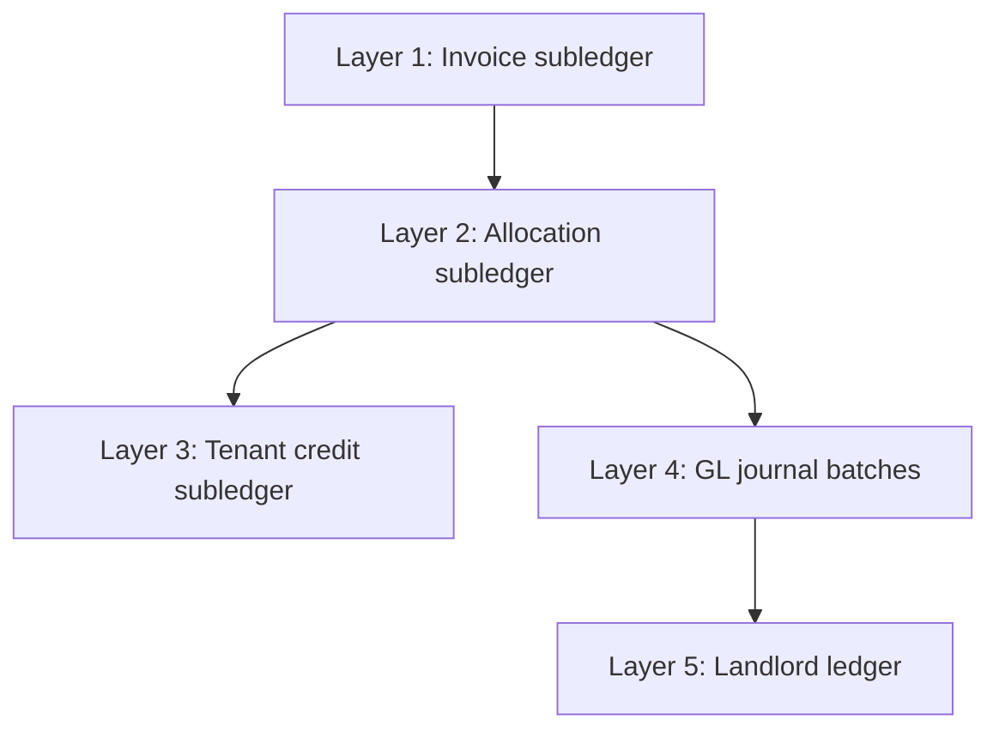
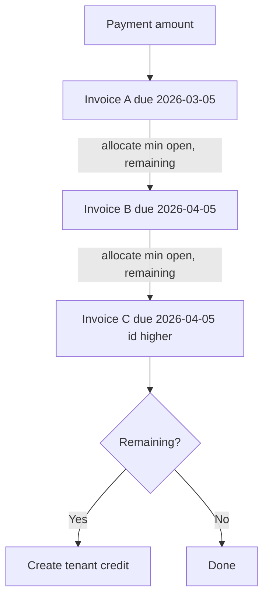
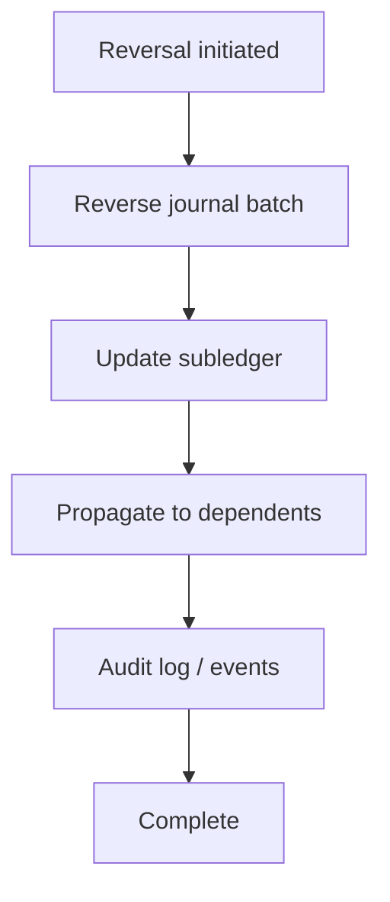

# Utility Billing Governance Rules

**Version:** 1.0 (Governance baseline)  
**Sections:** Reconciliation · Period closing · Allocation priority · Reversal propagation

---

## 1. Reconciliation Rules

### 1.1 Purpose

Ensure subledgers (invoices, allocations, credit balances, readings) agree with trust GL and operational reports.

### 1.2 Reconciliation Layers



### 1.3 Layer 1 — Invoice Subledger

**Rule R-INV-1:** For every open water invoice:

```
invoice.amount - invoice.amount_paid = open_balance
```

**Rule R-INV-2:** `amount_paid` must equal:

```sql
SUM(pm_payment_allocations.amount)
WHERE pm_invoice_id = :id
  AND is_reversed = false
```

**Rule R-INV-3:** Water invoice open balance for penalties:

```
penalty_eligible_balance = invoice.amount - invoice.amount_paid
```

Must match sum of active (non-reversed) penalty applications + base billed amount logic.

**Rule R-INV-4:** One meter reading per unit per `billing_month`; invoiced readings must have valid `pm_invoice_id`.

**Reconciliation query (conceptual):**

| Check | Expected |
|-------|----------|
| Orphan readings (`invoiced` but no invoice) | 0 rows |
| Duplicate water invoices (same tenant, unit, billing_period) | 0 rows |
| Invoice status stale (overdue but due_date future) | 0 rows after refresh job |

### 1.4 Layer 2 — Allocation Subledger

**Rule R-ALLOC-1:** Sum of allocations for a payment ≤ `payment.amount` (non-reversed).

**Rule R-ALLOC-2:** No allocation to `cancelled` invoices.

**Rule R-ALLOC-3:** `bill_scope` on payment meta must be respected:

| `meta.bill_scope` | Allowed invoice types |
|-------------------|----------------------|
| `all` (default) | rent, water, mixed |
| `rent` | rent only |
| `water` | water only |

**Rule R-ALLOC-4:** Repair command (`payments:repair-allocations`) is authoritative for rebuilding — run after scope or data fixes.

### 1.5 Layer 3 — Tenant Credit Subledger

**Rule R-CREDIT-1:**

```
PmTenantCreditBalance.balance = SUM(credit_created) - SUM(credit_applied) - SUM(credit_refunded) ± adjustments
```

**Rule R-CREDIT-2:** Every `credit_applied` must have:
- Linked `PmPayment` with `channel = tenant_credit`
- At least one non-reversed allocation
- Matching `tenant_credit_applied` GL batch (when GL enabled)

**Rule R-CREDIT-3:** Credit balance must never be negative (enforce at service layer).

### 1.6 Layer 4 — GL Reconciliation

**Rule R-GL-1:** Every posted water invoice (Path A) has exactly one active `invoice_issued` batch for `source_type = pm_invoice`.

**Rule R-GL-2:** Utility AR (1210) balance in GL ≈ sum of open water + mixed invoice balances + unapplied penalty AR.

**Rule R-GL-3:** Suspense (1250) must be reviewed weekly; items older than 30 days require resolution or write-off policy.

**Rule R-GL-4:** Tenant credit liability (2260) ≈ sum of `PmTenantCreditBalance.balance` across tenants.

**Known exception:** Legacy Path B invoices have no GL — exclude from R-GL-1 until aligned (RISK R1).

### 1.7 Layer 5 — Landlord Ledger

**Rule R-LL-1:** Landlord credits post only via `finalizeIdentifiedPayment()` settlement path.

**Rule R-LL-2:** Manual payments must be reconciled separately — compare payment list vs landlord ledger entries (RISK R3).

### 1.8 Reconciliation Schedule

| Frequency | Activity | Owner |
|-----------|----------|-------|
| Daily | Run `invoices:refresh-statuses` | Automation |
| Weekly | Suspense account review (1250) | Agent finance |
| Monthly | Water AR aging vs 1210 GL | Agent finance |
| Monthly | Credit balance vs 2260 GL | Agent finance |
| Monthly | Reading completeness (all occupied units) | Property manager |
| Ad hoc | `payments:repair-allocations` after data fix | Engineering |

---

## 2. Period Closing Rules

### 2.1 Billing Period Definition

- **Water billing period:** Calendar month (`billing_period = YYYY-MM`)
- **Issue date:** Typically first days of following month (automation default)
- **Due date:** Default 5th of month following billing period (cron default)

### 2.2 Period Close Phases


### 2.3 Phase Rules

| Phase | Rule ID | Description |
|-------|---------|-------------|
| **Reading lock** | PC-1 | All occupied units must have reading OR documented exception before invoice run |
| **Reading lock** | PC-2 | No deletes of readings once period invoiced |
| **Invoice generation** | PC-3 | Meter path only for automated run; legacy path requires manual sign-off |
| **Invoice generation** | PC-4 | Duplicate detection: one water invoice per tenant + unit + billing_period |
| **Penalty run** | PC-5 | Penalties only after grace period from `PmPenaltyRule.grace_days` |
| **Penalty run** | PC-6 | Penalty run idempotent per (invoice, rule, threshold_date) |
| **Allocation repair** | PC-7 | Run repair if any payment scope corrections in period |
| **Status refresh** | PC-8 | Batch refresh all non-draft, non-cancelled invoices |
| **Reconciliation** | PC-9 | R-GL-2 and R-CREDIT-1 must pass before lock |
| **Period locked** | PC-10 | No backdated readings/invoices without admin override ⚠ target |

### 2.4 Period Lock (Target Policy) ⚠

Not implemented in code. Target behavior:

| Action | Allowed after lock? |
|--------|---------------------|
| Record reading for closed period | No (requires override) |
| Generate invoice for closed period | No |
| Apply penalty | Yes (based on due date, not billing period) |
| Receive payment | Yes |
| Reverse payment/penalty | Yes (with audit) |

### 2.5 Month-End Checklist

- [ ] All units billed or on uninvoiced exception report
- [ ] Automation toggles logged (on/off) for audit
- [ ] 1210 subledger vs GL tie-out
- [ ] 2260 subledger vs GL tie-out
- [ ] 1250 suspense items reviewed
- [ ] Landlord payable tie-out (settlement path payments)
- [ ] Penalty applications reviewed for reasonableness
- [ ] `UtilityAuditLog` sampled for period

---

## 3. Allocation Priority Rules

### 3.1 Policy Statement

Tenant receipts are applied to **open invoices** (where `amount_paid < amount` and status ≠ cancelled) using deterministic ordering to prevent arbitrary allocation disputes.

### 3.2 Priority Order (Implemented)

**Primary sort:** `due_date ASC` (oldest due first)  
**Secondary sort:** `id ASC` (stable tie-breaker)



### 3.3 Scope Rules

| Source | Scope source | Filter |
|--------|--------------|--------|
| Tenant portal payment | Request `bill_scope` | rent / water / all |
| STK / advance settlement | `payment.meta.bill_scope` | rent / water / all |
| Tenant credit auto-apply | **None** | **All invoice types** ⚠ |
| Manual payment to specific invoice | N/A | Direct to chosen invoice |
| Allocation repair | Replay each payment's meta | Per original scope |

### 3.4 Policy Rules

| Rule ID | Rule |
|---------|------|
| AP-1 | Oldest `due_date` always paid before newer |
| AP-2 | Same due date: lower invoice `id` first |
| AP-3 | Scoped payments must not allocate to out-of-scope invoice types |
| AP-4 | **Target:** Tenant credit auto-apply should honor tenant's last scope or configurable policy ⚠ |
| AP-5 | Partial allocation allowed; invoice → `partial` status |
| AP-6 | Before each allocation step, sync `amount_paid` from allocations (prevent double-allocate) |
| AP-7 | Manual direct payment bypasses priority (agent explicit choice) |

### 3.5 Priority vs Invoice Type

When `bill_scope = all`, **rent and water compete solely on due_date** — not by type priority.

**Example:**

| Invoice | Type | Due date | Paid first? |
|---------|------|----------|-------------|
| W-001 | water | 2026-03-01 | Yes |
| R-001 | rent | 2026-03-05 | Second |

**Target policy option (finance decision):** Water-before-rent or rent-before-water override — **not implemented**.

### 3.6 Overpayment Handling

| Condition | Action |
|-----------|--------|
| Credit tables exist | `TenantCreditService.createCreditFromOverpayment()` |
| Credit tables missing | `postUnmatchedPaymentToSuspense()` |

---

## 4. Reversal Propagation Rules

### 4.1 Propagation Model

Reversals must flow **GL → subledger → dependent entities** in a single database transaction.



### 4.2 Payment Reversal

| Step | Action | Required |
|------|--------|----------|
| 1 | Set payment `reversal_status = reversed`, `status = failed` | Yes |
| 2 | Reverse `payment_received` journal batch | Yes |
| 3 | Set all payment allocations `is_reversed = true` | Yes |
| 4 | Recompute affected invoices `amount_paid` + status | Yes |
| 5 | Reverse landlord ledger credits | Yes (settlement path) |
| 6 | Reverse tenant credit created from overpayment | **No — gap** ⚠ |
| 7 | Reverse synthetic credit-apply payments | **No — gap** ⚠ |

**Rule RP-PAY-1:** Payment reversal must restore invoice open balances before penalty re-evaluation.

**Rule RP-PAY-2:** Reversal requires maker/checker approval (`PropertyPaymentReversalApprovalService`).

### 4.3 Penalty Reversal

| Step | Action | Required |
|------|--------|----------|
| 1 | Validate application not already reversed | Yes |
| 2 | Reduce `invoice.amount` by penalty amount | Yes |
| 3 | Reverse `water_penalty_applied` journal | Yes |
| 4 | Set `reversed_at`, `reversed_by`, `reversal_reason` | Yes |
| 5 | Recompute invoice status if now paid | Yes |
| 6 | `UtilityAuditLog: penalty_reversed` | Yes |

**Rule RP-PEN-1:** Cannot reverse penalty if payment already applied specifically to penalty portion (header model — entire balance is fungible).

### 4.4 Invoice Cancellation / Deletion

| Step | Action | Required |
|------|--------|----------|
| 1 | Block if payments allocated (unless reversed first) | Yes |
| 2 | `reverseInvoiceIssued()` | Yes |
| 3 | Set status `cancelled` | Yes |
| 4 | Unlink reading (`pm_invoice_id = null`, status → recorded) | **No — gap** ⚠ |

**Rule RP-INV-1:** Cancelled water invoice must not remain referenced by invoiced reading (target).

### 4.5 Invoice Amount Edit

| Step | Action |
|------|--------|
| 1 | `reverseInvoiceIssued()` on current batch |
| 2 | Post new batch with `invoice_issued_rev_N` |
| 3 | Invoice `amount` updated |

**Rule RP-INV-2:** If edit reduces amount below `amount_paid`, trigger credit or refund workflow (manual today).

### 4.6 Tenant Credit Reversal (Target) ⚠

| Event | Propagation |
|-------|-------------|
| Reverse `credit_applied` | Restore balance; reverse allocation; reverse GL; mark synthetic payment failed |
| Reverse `credit_created` | Reduce balance; if from payment, link to payment reversal |

**Rule RP-CREDIT-1:** Credit reversal must use transaction type `credit_reversed` (defined, not wired).

### 4.7 Cross-Entity Propagation Matrix

| Trigger | Invoice | Reading | Allocation | Credit | GL | Landlord ledger |
|---------|---------|---------|------------|--------|----|-----------------|
| Payment reversal | Update paid | — | Reverse | **Gap** | Reverse | Reverse |
| Penalty reversal | Reduce amount | — | — | — | Reverse | — |
| Invoice cancel | Cancel | **Gap** unlink | Block/reverse first | — | Reverse | — |
| Credit refund | — | — | — | Reduce | Post refund | — |

### 4.8 Reversal Ordering Constraints

1. Cannot cancel invoice with active (non-reversed) allocations
2. Cannot delete reading in `invoiced` state
3. Penalty reversal on fully paid invoice: only if open balance accounting allows (amount may exceed paid after reversal → partial/overdue)
4. Payment reversal after period close: **allowed** but must appear in reconciliation exceptions

---

## 5. Governance Enforcement

During governance mode, code changes must:

1. Reference rule IDs when fixing gaps (e.g. "Implements RP-INV-1")
2. Not introduce new allocation or posting behavior without updating this document
3. Include reconciliation test notes for any posting path change
