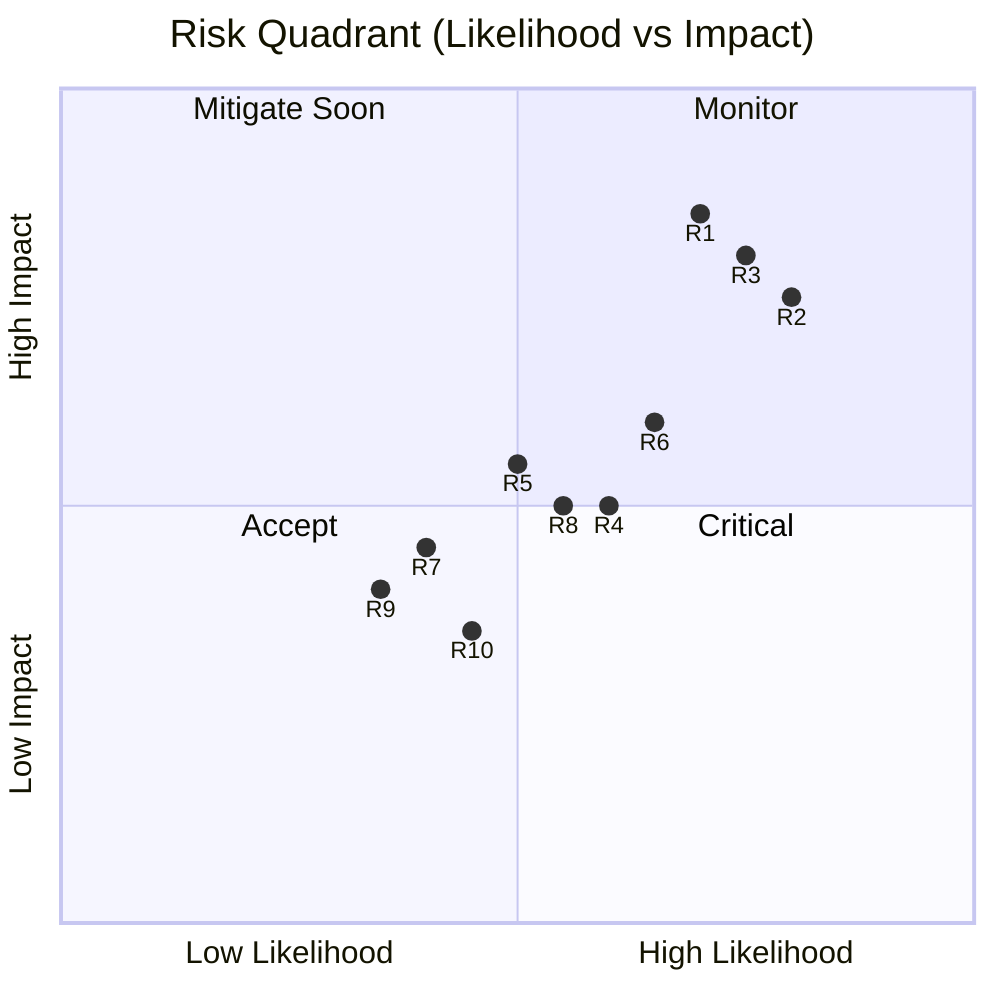
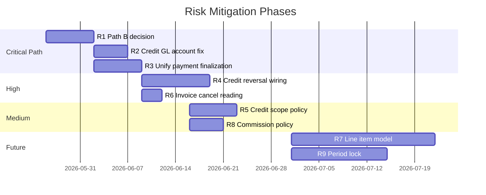

# Utility Billing Risk Matrix

**Version:** 1.0 (Governance baseline)  
**Last assessed:** 2026-05-25  
**Scale:** Likelihood (L) × Impact (I) = Risk Score (1–9)

| Score | Priority |
|-------|----------|
| 7–9 | Critical — block feature work until mitigated |
| 4–6 | High — mitigate before next release |
| 1–3 | Medium — track and schedule |

---

## 1. Risk Summary Dashboard

---

## 2. Detailed Risk Register

### R1 — Dual billing paths without GL parity

| Field | Value |
|-------|-------|
| **Category** | Accounting integrity |
| **Description** | Legacy `PmUnitUtilityCharge` → `generateUtilityInvoices()` creates water invoices without GL posting, tenant credit auto-apply, or audit log |
| **Likelihood** | High (0.7) — path still accessible in UI |
| **Impact** | Critical (0.85) — subledger/GL divergence |
| **Score** | **6** (High) |
| **Affected rules** | R-GL-1, AP1 |
| **Mitigation** | Retire Path B or add parity (GL + audit + credit); mark UI deprecated |
| **Owner** | Engineering + Finance |
| **Target** | Before exiting governance mode |

---

### R2 — Tenant credit GL credits wrong AR account

| Field | Value |
|-------|-------|
| **Category** | Accounting misclassification |
| **Description** | `postTenantCreditApplied()` always credits 1200 Rent AR, even when credit pays water invoice (1210) |
| **Likelihood** | High (0.8) — occurs on every credit apply to water |
| **Impact** | High (0.75) — 1200/1210 imbalance |
| **Score** | **6** (High) |
| **Affected rules** | AP2, R-GL-2 |
| **Mitigation** | Resolve AR account from allocation invoice type |
| **Owner** | Engineering |
| **Target** | Sprint 1 post-governance |

---

### R3 — Landlord ledger skipped on manual payments

| Field | Value |
|-------|-------|
| **Category** | Landlord payable accuracy |
| **Description** | `PmPaymentController::store` and `PmInvoiceController::recordPayment` post GL but skip `postLandlordLedgerCredits()` |
| **Likelihood** | High (0.75) — manual payments common |
| **Impact** | High (0.8) — landlord underpayment |
| **Score** | **6** (High) |
| **Affected rules** | R-LL-1, AP3 |
| **Mitigation** | Route all payments through `PropertyPaymentSettlementService::finalizeIdentifiedPayment()` |
| **Owner** | Engineering |
| **Target** | Sprint 1 post-governance |

---

### R4 — Payment reversal does not unwind tenant credit

| Field | Value |
|-------|-------|
| **Category** | Subledger integrity |
| **Description** | Reversing a payment that created overpayment credit does not reduce credit balance or reverse synthetic credit-apply payments |
| **Likelihood** | Medium (0.6) |
| **Impact** | High (0.5) — phantom credit |
| **Score** | **4** (High) |
| **Affected rules** | RP-PAY-6/7, RP-CREDIT-1 |
| **Mitigation** | Implement credit reversal propagation; wire `credit_reversed` type |
| **Owner** | Engineering |
| **Target** | Sprint 2 |

---

### R5 — Tenant credit auto-apply ignores bill_scope

| Field | Value |
|-------|-------|
| **Category** | Business logic / tenant expectation |
| **Description** | Tenant portal supports water-only payments, but auto-applied credit pays all open invoices by due date |
| **Likelihood** | Medium (0.5) |
| **Impact** | Medium (0.55) — rent paid when tenant expected water-only credit use |
| **Score** | **3** (Medium) |
| **Affected rules** | AP-4 |
| **Mitigation** | Configurable credit apply scope; document tenant-facing behavior |
| **Owner** | Product + Engineering |
| **Target** | Sprint 2 |

---

### R6 — Invoice cancel leaves reading invoiced

| Field | Value |
|-------|-------|
| **Category** | Data consistency |
| **Description** | Cancelling water invoice does not reset reading to `recorded` or clear `pm_invoice_id` |
| **Likelihood** | Medium (0.65) |
| **Impact** | Medium (0.6) — cannot re-invoice period without manual fix |
| **Score** | **4** (High) |
| **Affected rules** | RP-INV-1 |
| **Mitigation** | On cancel, unlink reading if linked |
| **Owner** | Engineering |
| **Target** | Sprint 2 |

---

### R7 — Penalty mutates header amount without line items

| Field | Value |
|-------|-------|
| **Category** | Reporting / audit |
| **Description** | Penalties increment invoice header; no `pm_invoice_items`; description append only |
| **Likelihood** | Medium (0.4) — by design |
| **Impact** | Medium (0.45) — hard to reconcile penalty vs base on statements |
| **Score** | **2** (Medium) |
| **Affected rules** | — |
| **Mitigation** | Future line-item model; until then, rely on `PmInvoicePenaltyApplication` report |
| **Owner** | Product |
| **Target** | Future phase |

---

### R8 — Commission applied uniformly to water collections

| Field | Value |
|-------|-------|
| **Category** | Financial policy |
| **Description** | Water payments run through same commission split as rent in `postPaymentReceived()` |
| **Likelihood** | Medium (0.55) |
| **Impact** | Medium (0.5) — may over/under charge management fee |
| **Score** | **3** (Medium) |
| **Affected rules** | AP5 |
| **Mitigation** | Finance policy decision; implement type-specific commission if needed |
| **Owner** | Finance |
| **Target** | Policy decision before implementation |

---

### R9 — No period lock enforcement

| Field | Value |
|-------|-------|
| **Category** | Operational control |
| **Description** | Backdated readings/invoices can be created after month close; no system enforcement |
| **Likelihood** | Low (0.35) |
| **Impact** | Medium (0.4) — restatement risk |
| **Score** | **1** (Medium) |
| **Affected rules** | PC-10 |
| **Mitigation** | Implement period lock table + override workflow |
| **Owner** | Engineering + Ops |
| **Target** | Phase 2 |

---

### R10 — AccountingUtilityPayment disconnected

| Field | Value |
|-------|-------|
| **Category** | Scope confusion |
| **Description** | Provider utility payments (`AccountingUtilityPayment`) not linked to tenant water billing |
| **Likelihood** | Low (0.45) — separate workflow |
| **Impact** | Low (0.35) — confusion in reporting |
| **Score** | **2** (Medium) |
| **Affected rules** | — |
| **Mitigation** | Document boundary (ARCHITECTURE §1.2); no code merge without design |
| **Owner** | Product |
| **Target** | Ongoing |

---

## 3. Risk by Domain

| Domain | Critical | High | Medium |
|--------|----------|------|--------|
| Accounting / GL | R1 | R2 | R7, R8 |
| Payments / allocation | — | R3, R4 | R5 |
| Data consistency | — | R6 | R9 |
| Scope / product | — | — | R10 |

---

## 4. Gap → Risk Mapping

| Gap (from architecture review) | Risk ID |
|----------------------------------|---------|
| Legacy path no GL | R1 |
| Credit apply CR 1200 not 1210 | R2 |
| Manual payment no landlord ledger | R3 |
| Payment reversal incomplete for credit | R4 |
| Credit auto-apply no scope | R5 |
| Cancel invoice reading stuck | R6 |
| No invoice line items for water | R7 |
| Uniform commission on water | R8 |
| `credit_reversed` unused | R4 |
| No reading void/correct states | R9 (partial) |
| Duplicate detection differs by path | R1, R6 |

---

## 5. Mitigation Roadmap

---

## 6. Pre-Feature Risk Gate

Before implementing any new utility billing feature, confirm:

| Gate | Question |
|------|----------|
| G1 | Does it use Path A (meter) only, or is Path B updated in same PR? |
| G2 | Does it post GL per ACCOUNTING-POLICY.md? |
| G3 | Does it respect allocation rules AP-1 through AP-7? |
| G4 | Does reversal propagate per GOVERNANCE-RULES §4? |
| G5 | Does it add rows to RISK-MATRIX if new gaps found? |
| G6 | Is automation gated by portal settings? |

**Blockers (must be resolved or explicitly accepted):** R1 decision, R2, R3 for any payment/GL-touching feature.

---

## 7. Acceptance of Residual Risk

| Risk | Accept temporarily? | Condition |
|------|---------------------|-----------|
| R7 | Yes | Penalty application table is audit source |
| R9 | Yes | Manual month-end checklist until period lock built |
| R10 | Yes | Documented out of scope |
| R1 | **No** | Must decide align vs retire before features |
| R2, R3 | **No** | Fix before production scale |

---

## 8. Review Schedule

| Review | Frequency | Participants |
|--------|-----------|--------------|
| Risk register update | Each sprint | Engineering lead |
| Accounting gap review | Monthly | Finance + Engineering |
| Full governance doc refresh | Quarterly | Product, Finance, Engineering |
