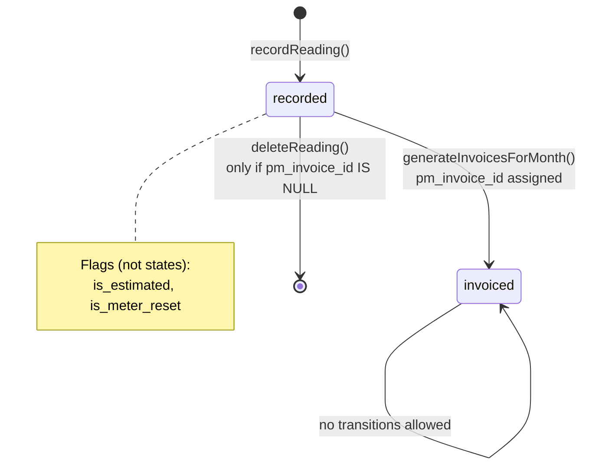
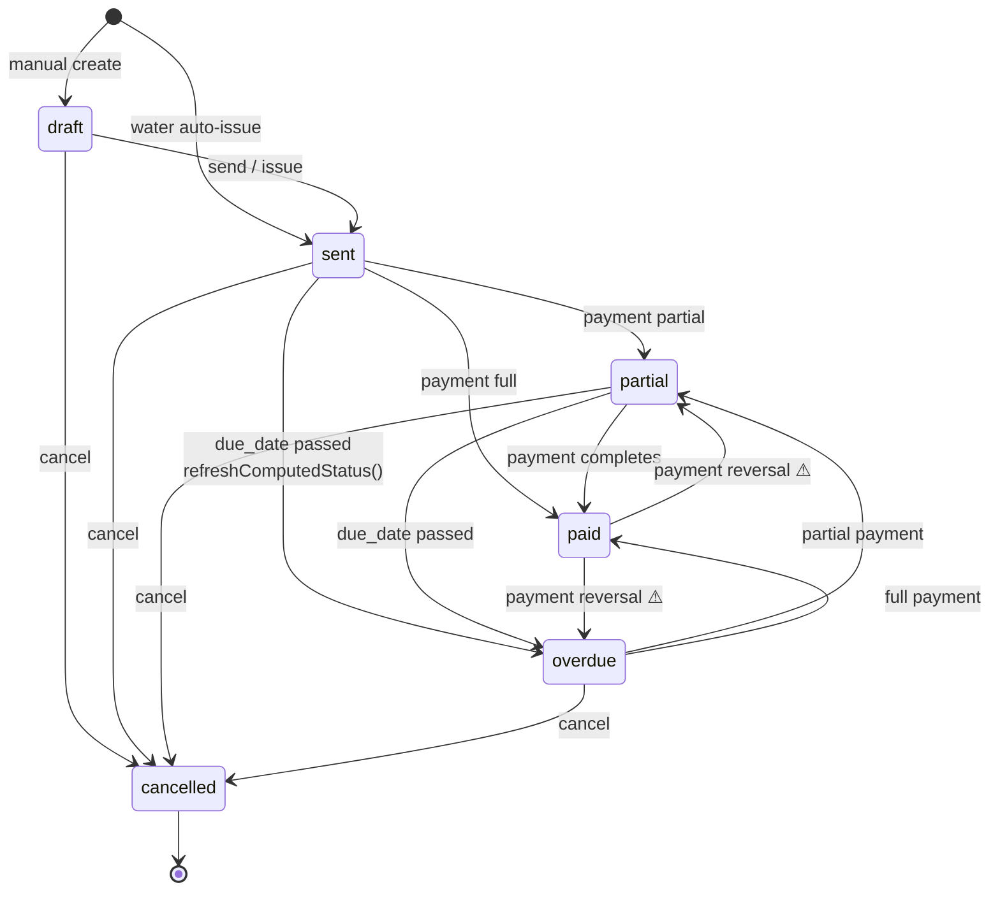
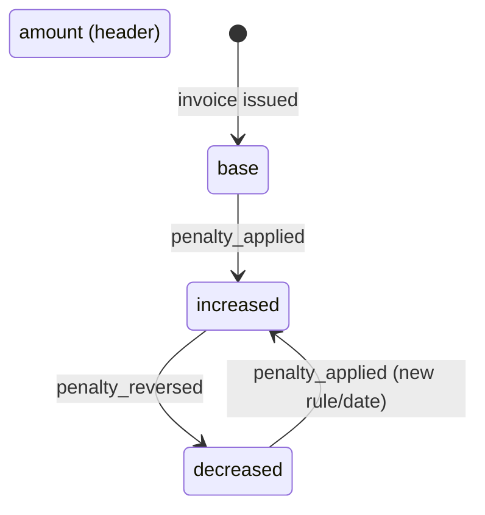
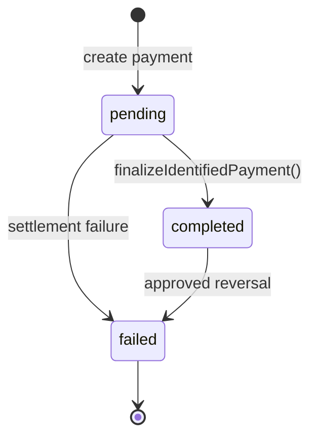
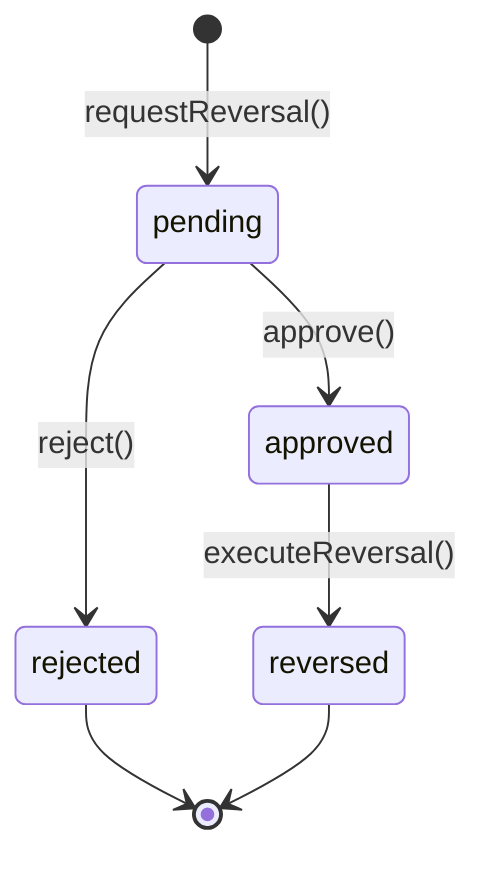
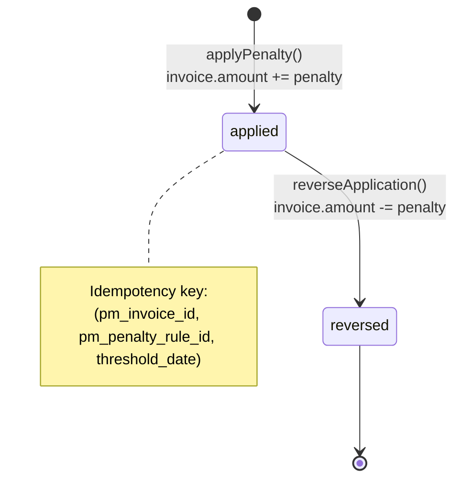
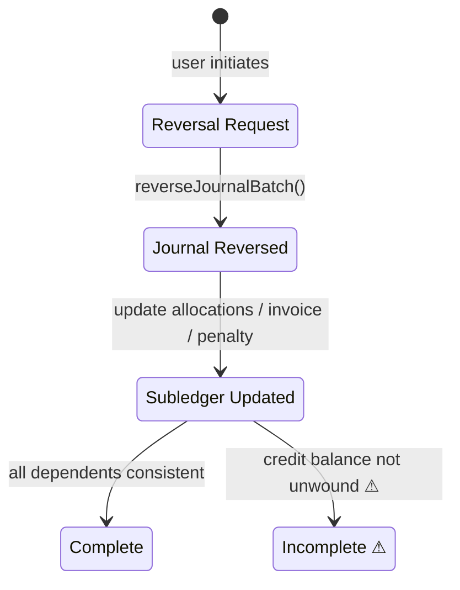
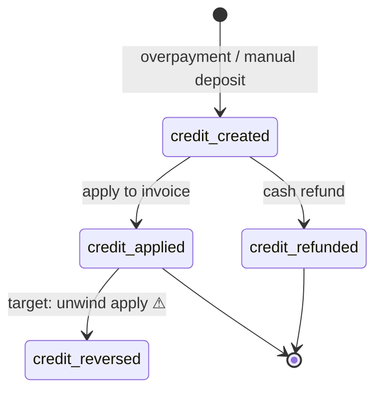
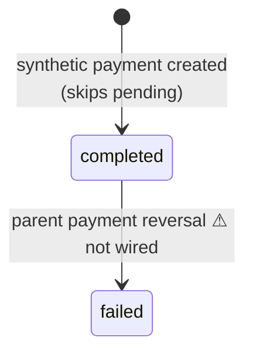
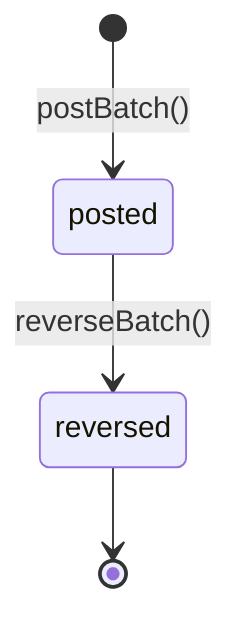

# Utility Billing State Machine

**Version:** 1.0 (Governance baseline)  
**Purpose:** Formal state definitions and allowed transitions for all utility billing entities.

Legend:
- **Implemented** — exists in code today
- **Target** — policy not yet enforced in code (marked with ⚠)

---

## 1. Water Reading States

### 1.1 States

| State | Description | Set by |
|-------|-------------|--------|
| `recorded` | Reading captured; eligible for invoicing | `WaterBillingService::recordReading()` |
| `invoiced` | Linked to `pm_invoice_id`; immutable | `WaterBillingService::generateInvoicesForMonth()` |

### 1.2 State Diagram

### 1.3 Transition Rules

| From | To | Trigger | Preconditions | Side effects |
|------|-----|---------|---------------|--------------|
| — | `recorded` | Agent records reading | Unique unit + billing_month; valid meter values | `UtilityAuditLog: reading_recorded` |
| `recorded` | `invoiced` | Invoice generation | Active lease; amount > 0; no duplicate | Set `pm_invoice_id`, audit log |
| `recorded` | — (deleted) | Agent delete | `pm_invoice_id` is null | Hard delete row |
| `invoiced` | — | — | **Forbidden** | — |

### 1.4 Target States (Not Implemented) ⚠

| State | Purpose |
|-------|---------|
| `voided` | Cancel erroneous reading before invoicing with audit |
| `corrected` | Superseded by amended reading row |

---

## 2. Invoice States

### 2.1 States

| State | Type | Description |
|-------|------|-------------|
| `draft` | Manual | Not yet issued; no GL |
| `sent` | Manual / default on water issue | Issued, not fully paid, not overdue |
| `partial` | **Computed** | `0 < amount_paid < amount` |
| `paid` | **Computed** | `amount_paid >= amount` |
| `overdue` | **Computed** | Unpaid/partial and `due_date < today` |
| `cancelled` | Manual | Voided; GL reversed |

**Invoice types:** `rent`, `water`, `mixed`  
**Invoice kinds:** `invoice`, `credit_note`

### 2.2 State Diagram

### 2.3 Computation Logic (`PmInvoice::refreshComputedStatus`)

Priority order (implemented):

1. If `amount_paid >= amount` → `paid`
2. Else if `amount_paid > 0` → `partial`
3. Else if current status is `draft` → remain `draft`
4. Else if `due_date` is past → `overdue`
5. Else → `sent`

**Manual-only transitions:** `draft`, `sent`, `cancelled` can be set by controllers.  
**Batch refresh:** `invoices:refresh-statuses` recomputes stale open invoices.

### 2.4 Water Invoice Amount Mutations

Invoice `amount` can increase **after** `sent` via penalty application (not a status change):

Status is recomputed after payment sync, not after penalty apply.

---

## 3. Payment States

### 3.1 Payment Status

| State | Description |
|-------|-------------|
| `pending` | Awaiting settlement (e.g. STK callback) |
| `completed` | Allocated and GL posted |
| `failed` | Reversed or failed |

### 3.2 Reversal Status (Workflow)

| State | Description |
|-------|-------------|
| `pending` | Reversal requested, awaiting approval |
| `approved` | Approved (intermediate) |
| `rejected` | Request denied |
| `reversed` | Reversal executed |

### 3.3 Allocation Row State

| Field | Values | Meaning |
|-------|--------|---------|
| `is_reversed` | `false` / `true` | Whether allocation counts toward `amount_paid` |

Only allocations with `is_reversed = false` contribute to invoice balance.

---

## 4. Penalty Application States

Penalties use **timestamp-based lifecycle** on `PmInvoicePenaltyApplication`, not a string status column.

| Phase | Condition | Description |
|-------|-----------|-------------|
| **Applied** | `applied_at` set, `reversed_at` null | Active penalty on invoice |
| **Reversed** | `reversed_at` set | Penalty undone; invoice amount reduced |

**Rule eligibility:** `PmPenaltyRule.is_active = true`, `scope = 'water'`.

---

## 5. Reversal States (Cross-Entity)

Reversal is not a single entity; it is a **coordinated transaction** across layers:

| Reversal type | Journal event | Subledger updates |
|---------------|---------------|-------------------|
| Payment | Reverse `payment_received` | Allocations reversed, `amount_paid` reduced, landlord ledger reversed |
| Water penalty | Reverse `water_penalty_applied` | Application `reversed_at`, invoice amount reduced |
| Invoice cancel | `invoice_issued_reversal` | Invoice `cancelled`, reading may remain `invoiced` ⚠ |
| Invoice edit | `invoice_issued_reversal` + new revision | Amount/description updated |

---

## 6. Tenant Credit States

### 6.1 Balance

`PmTenantCreditBalance.balance` is a **scalar** (not an enum). Effective states:

| Effective state | Condition |
|-----------------|-----------|
| Zero | `balance = 0` |
| Positive | `balance > 0` (tenant has advance) |

### 6.2 Transaction Types

| Type | Effect on balance | Mode |
|------|-------------------|------|
| `credit_created` | +amount | automatic (overpay) or manual |
| `credit_applied` | −amount | automatic or manual |
| `credit_refunded` | −amount | manual (cash refund) |
| `credit_reversed` | +amount (target) | **Not implemented** ⚠ |
| `manual_adjustment` | ±amount | manual |

### 6.3 Synthetic Payment (Credit Apply)

When credit is applied, a `PmPayment` with `channel = tenant_credit` is created:

---

## 7. GL Batch States

`AccountingJournalBatch.status`:

| State | Description |
|-------|-------------|
| `posted` | Active journal entry |
| `reversed` | Superseded by reversal batch |

**Event types (utility-related):**

| event_type | Source |
|------------|--------|
| `invoice_issued` | Water/rent/mixed invoice |
| `invoice_issued_reversal` | Cancel/delete/edit |
| `invoice_issued_rev_N` | Edit repost revision |
| `water_penalty_applied` | Penalty |
| `water_penalty_reversal` | Penalty undo |
| `payment_received` | Tenant payment |
| `payment_unmatched_suspense` | Unallocated receipt |
| `tenant_credit_applied` | Credit applied to invoice |
| `tenant_credit_refunded` | Credit cash refund |

---

## 8. Automation Job States

Console commands are **stateless runners**; operational state is inferred from logs and side effects:

| Job | Success indicator | Skip indicator |
|-----|-------------------|----------------|
| `water:generate-invoices` | Invoices created, readings → invoiced | Toggle off, no eligible readings |
| `water:apply-penalties` | Applications created | Toggle off, no overdue invoices |
| `invoices:refresh-statuses` | Count of status changes | No stale rows |
| `payments:repair-allocations` | Allocations rebuilt | No tenants in scope |

Target governance addition ⚠: `utility_job_runs` table for idempotent run tracking and period-close guards.

---

## 9. State Interaction Matrix

| Entity A | Entity B | Rule |
|----------|----------|------|
| Reading `invoiced` | Invoice `cancelled` | Reading stays invoiced; no auto-unlink ⚠ |
| Invoice `paid` | Penalty applied | Cannot apply to fully paid invoice (open balance = 0) |
| Payment `failed` | Credit `credit_created` | Credit not auto-reversed ⚠ |
| Penalty `reversed` | GL batch | Reversal batch required before application marked reversed |
| Invoice `draft` | GL | No `invoice_issued` batch until sent/issued |

---

## 10. Validation Checklist (Pre-Feature)

Before adding features, confirm:

- [ ] New states documented in this file
- [ ] Transitions have explicit preconditions and side effects
- [ ] GL event_type registered in ACCOUNTING-POLICY.md
- [ ] Reversal propagation rules updated in GOVERNANCE-RULES.md
- [ ] Risk matrix updated if new gaps introduced
